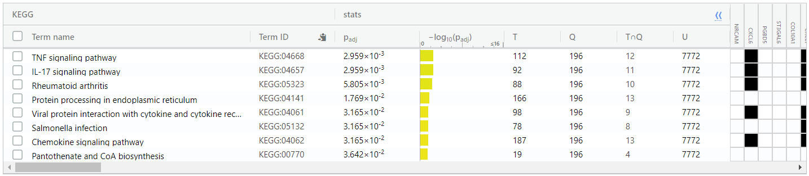

```{r setup, include=FALSE}
knitr::opts_chunk$set(echo = TRUE)
```

## Introduction

Begin by producing the cleaned, normalized, and mapped dataset from Assignment 1:

```{r a1, results='hide', message=FALSE}
source("data_processing.R")
```

data_processing.R is a script that implements the workflow performed in Assignment 1. It downloads the supplementary data file of GEO dataset [GSE110021](https://www.ncbi.nlm.nih.gov/geo/query/acc.cgi?acc=GSE110021).

The experiment treats an experimental group of WI-38 fibroblasts with TGFb (transforming growth factor beta) and measures gene expression in comparison to the untreated control group. Gene profiles are generated at 1-day and 20-day time points, so the experiment can be split into 4 groups. Each group has 3 replicates, so our experiment has 12 samples.

The experiment protocol has 4 columns per sample (totalling 48 columns in the downloaded data), corresponding to each lane on the sequencing machine. The script first collapses these individual lanes into a single column for the sample, resulting in an initial data frame of 12 columns (samples) and 25702 genes. Using edgeR, we filter out any genes of total CPM < 3, which is the size of our smallest group of replicates. This removes 12443 uninformative features, and we are left with 13259 genes. The remaining genes are normalized with respect to Treatment Type via edgeR TMM. Finally, the normalized genes have their given Ensemble gene IDs mapped to HGNC symbols, and any unmapped genes were removed. We also ensured that no two genes got mapped to the same symbol.

The final result is a data frame of 12 columns and 12914 rows, with unique HUGO identifiers as rownames. We will use this data frame in this assignment. Here are the first 10 rows and last 6 columns (day-20 for both treatments) of the data frame, to get an idea of what it looks like:

```{r}
knitr::kable(mapped_data[1:10, 7:12])
```

## Differential Gene Expression

Our analysis has defined noTGFb and TGFb as its groups, regardless of time. Our goal is to uncover time-independent DEGs in our samples by looking for significantly up/down-regulated genes after treatment with TGFb. Below are our previously generated MDS plots, pre- and post-normalization, and the neat clustering with respect to treatment type justifies the usage of Treatment as our principal factor:


Based on this, we should be able to get good results in the upcoming analysis.

Construct our model and run the differential analysis.
```{r}
library(edgeR)

d <- DGEList(counts=mapped_data, group=samples$Treatment)
# construct model
design <- model.matrix(~ samples$Day + samples$Treatment)

# estimate dispersion
d <- estimateDisp(d, design)
# calculate normalization factors
d <- calcNormFactors(d)
# fit model to data
fit <- glmQLFit(d, design)
# calculate differential expression
qlf_test <- glmQLFTest(fit, coef="samples$TreatmentTGFb")

# Get the results
qlf_output <- topTags(qlf_test, sort.by="PValue", n=nrow(mapped_data))
```

Let's see what our top results look like:
```{r}
# What does this look like?
knitr::kable(topTags(qlf_test, sort.by="PValue", n=20))
```

The glmQLFTest has a built in p-value correction called FDR, which uses Benjamini-Hochberg's multiple testing method to lower false discovery rate of significantly expressed genes. We will use this parameter to threshold our corrected gene p-values. Both p-value and FDR are thresholded at < 0.05, an arbitrary threshold, but one that has been the standard in most areas of statistical testing.

```{r}
# How many genes have p < 0.05?
length(which(qlf_output$table$PValue < 0.05))

# How many genes have FDR < 0.05?
length(which(qlf_output$table$FDR < 0.05))
```

We see that 2925 genes pass the threshold p-value, but after adjustment, this number drops to 467. We conclude that these 467 genes are my significantly differentially expressed genes. Get a separate list of up and down regulated genes.

```{r}
de_genes <- qlf_output[qlf_output$table$FDR < 0.05, ]
# Upregulated genes.
upreg_genes <- de_genes[de_genes$table$logFC > 0, ]
# How many?
nrow(upreg_genes)

# Down regulated genes.
downreg_genes <- de_genes[de_genes$table$logFC < 0, ]
# How many?
nrow(downreg_genes)
```

We have 285 upregulated genes and 182 downregulated genes after treatment.

Let's visualize our DEGs with a heatmap and an MA plot.

```{r, results='hide', message=FALSE}
if (! requireNamespace("ComplexHeatmap", quietly = TRUE)) {
    BiocManager::install("ComplexHeatmap")
}
if (! requireNamespace("circlize", quietly = TRUE)) {
    install.packages("circlize")
}
```
```{r}
# Get top hits only
sig_names <- rownames(de_genes)
heatmap_matrix <- t(scale(t(mapped_data[sig_names, ])))
# Define colour palette
heatmap_col <- circlize::colorRamp2(c(min(heatmap_matrix), 0, max(heatmap_matrix)), c("blue", "white", "red"))

heatmap <- ComplexHeatmap::Heatmap(as.matrix(heatmap_matrix), cluster_rows=TRUE,
                   cluster_columns=TRUE,
                   show_row_dend=TRUE,
                   show_column_dend=TRUE,
                   col=heatmap_col,
                   show_column_names=TRUE,
                   show_row_names=FALSE,
                   show_heatmap_legend=TRUE,
                   column_title="Heatmap of Top Hits")
heatmap

dim(heatmap_matrix)
```

We see a signficant increase in expression levels between D1 and D20 samples. This is indicative of a systemic upregulation in genes of interest over time for both the control group and the experimental group.

MA Plot:
```{r}
my_maplot <- edgeR::plotSmear(qlf_test, de.tags=rownames(de_genes), main="MA Plot")
```

The red points represent significantly up or down regulated genes (FDR < 0.05) by tagging them with the rownames of the de_genes subset. This is a clear visualization that we have a sizable set of DEGs with good FDR values, and that there are slightly more up-regulated than down-regulated genes.

## Thresholded Over-Representation Analysis

To make things easier, I created 3 text files called `de_genes.txt` (all DEGS), `upreg_genes.txt` (upregulated only), and `downreg_genes.txt` (down regulated only). The follow snippet fills these files with the gene names of my top hits. The gene names can now be easily copy-pasted into g:Profiler.
```{r}
file1 <- file("de_genes.txt")
file2 <- file("upreg_genes.txt")
file3 <- file("downreg_genes.txt")
writeLines(rownames(de_genes), file1)
writeLines(rownames(upreg_genes), file2)
writeLines(rownames(downreg_genes), file3)
close(file1)
close(file2)
close(file3)
```

A g:Profiler (https://biit.cs.ut.ee/gprofiler/gost) query returns our over-represented genesets. I chose to use g:Profiler due to the ease of use of its graphical web interface, ease of parsing the returned data, and familiarity with its functions from the homework. 

Copy-paste the contents of `ge_genes.txt` into the query box. Set the threshold to Benjamini-Hochberg FDR (multiple hypothesis testing) and choose GO biological processes, Reactome, KEGG, and WikiPathways as my annotation sources. According to g:Profiler, GO biological processes was last released on 2019-07-01, Reactome was last released on 2019-10-02, KEGG was last released on 2019-09-30, and WikiPathways was last released on 2019-09-10. This means that all my sources have been updated within the past approximately half a year, making them all recent enough for good analysis. I chose these 4 pathways because I wanted as many datasets pertaining to biological processes as possible, as identifying these pathways is the goal of this analysis.

The following screencaps show the top results of g:Profiler from all datasets (WikiPathway returned 0 results). Initially, no restriction was placed on the term sizes.





I then placed an arbitrary restriction on the term sizes of 5-200 (emulating the homework assignment) to remove large pathways and focus on smaller, more local ones. Only the results for GO:BP change:


### Upregulated genes only

The most significant difference when we query only the upregulated genes separately is the discovery of 2 results from WikiPathway (whereas the entire list failed to produce any results). They are summarized in the following screenshot of the results table:


### Downregulated genes only

The results of querying downregulated genes are extremely interesting, as almost all results have been lost except for a single term from GO:BP and 2 more terms from WikiPathways. 


## Interpretation

Overall, it seems that after treatment with TGFb, over-represented genesets largely include those related to cellular signalling, protein folding, and cellular development. These results share similarities with those found in the primary research paper that cites the original dataset (PMID: [31889146](https://www.ncbi.nlm.nih.gov/pubmed/31889146), Walker et al, 2019). Walker identifies the biological pathways in which gene expression has been significantly altered by TGF-b treatment to be those with regards to cytoskeletal remodeling, chemokine-mediated cell adhesion, integrin-mediated cell adhesion, cell migration, immune response, and other signal transduction pathways.

The results in above share common pathways. Notably, GO:BP, KEGG, and REAC all have chemokine-related cellular functions (receptors and response) in their top terms. Additionally, WikiPathway contains integrin-mediated cell adhesion when we query with downregulated genes only. Cellular migration mechanisms, such as chemotaxis, for various cell types is prevalent in GO:BP. The commonalities bewteen my over-represeneted genesets and Walker's demonstrates that our findings agree. The paper connects the change in integrin-mediated cell adhesion to contributing to the contracting airway of asthamatic patients.

Further evidence of the results I see in my findings can be found by examining the role that Notch signalling pathways (extremely significant in GO:BP) have on the asthmatic phenotype. According to Walker, TGF-b induces transdifferentiation in the cell, which is a mechanism that can be employed by Notch signalling pathways (Yao et al, 2017, https://stemcellsjournals.onlinelibrary.wiley.com/doi/full/10.1002/stem.2744). Notch signalling has also been implicated in causing asthma and other pulmonary conditions by increasing the number of mucous cells in the lungs (Guseh et al, 2009, https://www.ncbi.nlm.nih.gov/pmc/articles/PMC2673763/). The mechanisms described in these two papers demonstrates the relevancy of my results in finding possible ways in which TGFb treatment can trigger asthmatic symptoms.

## References

* Walker, E. J., Heydet, D., Veldre, T., & Ghildyal, R. (2019). Transcriptomic changes during TGF-β-mediated differentiation of airway fibroblasts to myofibroblasts. Scientific Reports, 9(1), 1-14.

* Guseh, J. S., Bores, S. A., Stanger, B. Z., Zhou, Q., Anderson, W. J., Melton, D. A., & Rajagopal, J. (2009). Notch signaling promotes airway mucous metaplasia and inhibits alveolar development. Development, 136(10), 1751-1759.

* Yao, E., Lin, C., Wu, Q., Zhang, K., Song, H., & Chuang, P. T. (2018). Notch signaling controls transdifferentiation of pulmonary neuroendocrine cells in response to lung injury. Stem Cells, 36(3), 377-391.

* Gu, Z. (2016) Complex heatmaps reveal patterns and correlations in multidimensional genomic data. Bioinformatics.

* Gu, Z. (2014) circlize implements and enhances circular visualization in R. Bioinformatics.

* McCarthy DJ, Chen Y and Smyth GK (2012). Differential expression analysis of multifactor RNA-Seq experiments with
  respect to biological variation. Nucleic Acids Research 40, 4288-4297.
  
* Ritchie, M.E., Phipson, B., Wu, D., Hu, Y., Law, C.W., Shi, W., and Smyth, G.K. (2015). limma powers differential
  expression analyses for RNA-sequencing and microarray studies. Nucleic Acids Research 43(7), e47.
  
* Marc Carlson (2019). org.Hs.eg.db: Genome wide annotation for Human. R package version 3.8.2.

* R. Gentleman (2019). annotate: Annotation for microarrays. R package version 1.62.0.
