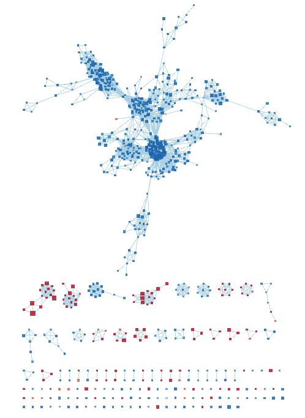

```{r setup, include=FALSE}
knitr::opts_chunk$set(echo = TRUE)
```

## Introduction

### Dataset Download and Cleaning

Begin by producing the cleaned, normalized, and mapped dataset from Assignment 1:

```{r a1, results='hide', message=FALSE}
source("data_processing.R")
```

data_processing.R is a script that implements the workflow performed in Assignment 1. It downloads the supplementary data file of GEO dataset [GSE110021](https://www.ncbi.nlm.nih.gov/geo/query/acc.cgi?acc=GSE110021).

The experiment treats an experimental group of WI-38 fibroblasts with TGFb (transforming growth factor beta) and measures gene expression in comparison to the untreated control group. Gene profiles are generated at 1-day and 20-day time points, so the experiment can be split into 4 groups. Each group has 3 replicates, so our experiment has 12 samples.

The experiment protocol has 4 columns per sample (totalling 48 columns in the downloaded data), corresponding to each lane on the sequencing machine. The script first collapses these individual lanes into a single column for the sample, resulting in an initial data frame of 12 columns (samples) and 25702 genes. Using edgeR, we filter out any genes of total CPM < 3, which is the size of our smallest group of replicates. This removes 12443 uninformative features, and we are left with 13259 genes. The remaining genes are normalized with respect to Treatment Type via edgeR TMM. Finally, the normalized genes have their given Ensemble gene IDs mapped to HGNC symbols, and any unmapped genes were removed. We also ensured that no two genes got mapped to the same symbol.

The final result is a data frame of 12 columns and 12914 rows, with unique HUGO identifiers as rownames. We will use this data frame in this assignment. Here are the first 10 rows and last 6 columns (day-20 for both treatments) of the data frame, to get an idea of what it looks like:

```{r}
knitr::kable(mapped_data[1:10, 7:12])
```

### Preliminary Differential Expression Analysis

We performed a QLF test on the cleaned data above. Then, after extracting genes with an FDR q-value of >0.05, we performed a thresholded ORA using g:Profiler and revealed some overrepresented pathways in our data. Specifically, we uncovered many pathways related to cellular development, cellar signalling, and chemotaxis. Our findings agreed with those of the original dataset (PMID: [31889146](https://www.ncbi.nlm.nih.gov/pubmed/31889146), Walker et al, 2019), which identified that TGFb treatment caused significant alteration to pathways regarding cytoskeletal remodeling, chemokine-mediated cell adhesion, integrin-mediated cell adhesion, cell migration, immune response, and other signal transduction.

```{r a2, results='hide', message=FALSE}
source("gene_ranking.R")
```

## Non-thresholded Geneset Enrichment Analysis

In A2, we extracted only the genes with a high enough p-value to perform a thresholded analysis. In this workflow we will use the full ranked geneset instead. The above script ranks the genes by log-fold change and produces the `ranked_genes` table, which we will write into a `ranked_genes.rnk` file for GSEA.

```{r rnk}
# Extract gene list and score by -log(qvalue) * sign(FC)
gene_table <- ranked_genes[["table"]]
gene_names <- rownames(gene_table)
q_value <- gene_table$FDR
signFC <- sign(gene_table$logFC)
rank <- -log(q_value) * signFC
rownames(gene_table) <- NULL
rnk_table <- cbind(gene_names, rank)
colnames(rnk_table) <- c("gene_names", "rank")
write.table(rnk_table, "ranked_genes.rnk", row.names=FALSE, sep='\t',quote=FALSE)
```

Using GSEA v4.0.3 (https://www.gsea-msigdb.org/gsea/index.jsp) on Windows, I used `ranked_genes.rnk` as my ranked gene list and `Human_GOBP_AllPathways_no_GO_iea_April_01_2020_symbol.gmt` (from http://download.baderlab.org/EM_Genesets/, April 2020 release) as my gene sets database as inputs for a pre-ranked GSEA. I set the remapping to `No_Collapse`, Max size to 200, and Min size to 15. The min size will remove noisy data from genesets that are too small to be meaningful, while the max size will save on unnecessary computation time that would be used on gene sets too large and complex for me to make meaningful interpretations.

Below are screenshots of the top 20 hits of each phenotype:


Comparing these results to my A2 results, we see that cell structure, migration, chemotaxis, and chemokine response are common across the most upregulated genesets. This represents a striking similarity to the g:Profiler thresholded ORA results. However, direct comparison is difficult, as the scope of each geneset here is largely different from those referenced by g:Profiler -- the genesets I used for GSEA are much more specific and smaller scope than the g:Profiler ones, which are more thematic (e.g. peptide ligand-binding receptors vs cellular signalling).

## Visualization in Cytoscape

I input the two xls files for the positive and negative (w.r.t. TGFb treatment) phenotypes to EnrichmentMap and entered the gmt file used earlier for GSEA. The thresholds I used a node cut-off of FDR = 0.05 and an edge similarity cutoff of 0.375 (default). The resulting full network looks like this:



This network has too many nodes and edges to meaningfully navigate, so I decreased the node cut-off to 0.01. After annotating by cluster and rearranging the nodes to be publication-ready, the result is this:


Collapsing the clusters into their themes to create a theme network results in the following graph:


### Comparison to g:Profiler Analysis

The network graph doesn't seem as visually powerful as the clustered network, so I will mainly use that for my interpretations. From the clusters we see many of the same pathways that were over-represented in our thresholded analysis, such as chemokine response, chemotaxis, cell cycle (specifically cell division phases) and protein folding/assembly (specifically mitochondrial translation, spliceosomal snrnp and tubulin folding). Additionally, many of the clusters refer to biochemical processes, which can be surmised to be analogous to the cellular signalling pathways found in GO:BP on g:Profiler.

Novel pathways (as in, not seen with g:Profiler) are those that involve interaction with nucleic acids (particularly RNA). Interestingly, the GSEA failed to capture or label any Notch signalling, which was a major focal point of my analysis and reflection in A2. 

### Evidence from Literature

Recall that the purpose of this analysis was to determine the mechanism by which TGFb treatment induces the asthmatic phenotype in fibroblast tissues. We can verify the results of the GSEA by finding prior research that links the above themes to asthma onset, even if they are not necessarily the same as those of GSEA.

Nicholas Lukacz published a review article on Nature Immunology that links chemokine activity and response levels in cells to the inflammatory nature of asthma. It proposes that the severity of the asthmatic response is proportional to the level of chemokine signalling (which triggers leukocyte migration in the airways). It is reasonable to infer that if TGFb causes significant upregulation in these pathways, this is a probable mechanism by which it induces asthma in human patient tissues. Suppressing these chemokines is a potential means of asthma treatment.

## References

* Walker, E. J., Heydet, D., Veldre, T., & Ghildyal, R. (2019). Transcriptomic changes during TGF-β-mediated differentiation of airway fibroblasts to myofibroblasts. Scientific Reports, 9(1), 1-14.

* Lukacs, N. Role of chemokines in the pathogenesis of asthma. Nat Rev Immunol 1, 108–116 (2001). https://doi.org/10.1038/35100503

* McCarthy DJ, Chen Y and Smyth GK (2012). Differential expression analysis of multifactor RNA-Seq experiments with
  respect to biological variation. Nucleic Acids Research 40, 4288-4297.
  
* Ritchie, M.E., Phipson, B., Wu, D., Hu, Y., Law, C.W., Shi, W., and Smyth, G.K. (2015). limma powers differential
  expression analyses for RNA-sequencing and microarray studies. Nucleic Acids Research 43(7), e47.
  
* Marc Carlson (2019). org.Hs.eg.db: Genome wide annotation for Human. R package version 3.8.2.

* R. Gentleman (2019). annotate: Annotation for microarrays. R package version 1.62.0.

* Shannon P, Markiel A, Ozier O, Baliga NS, Wang JT, Ramage D, Amin N, Schwikowski B, Ideker T.

* Cytoscape: a software environment for integrated models of biomolecular interaction networks. Genome Research 2003 Nov; 13(11):2498-504

* Enrichment Map: A Network-Based Method for Gene-Set Enrichment Visualization and Interpretation
Merico D, Isserlin R, Stueker O, Emili A, Bader GD
